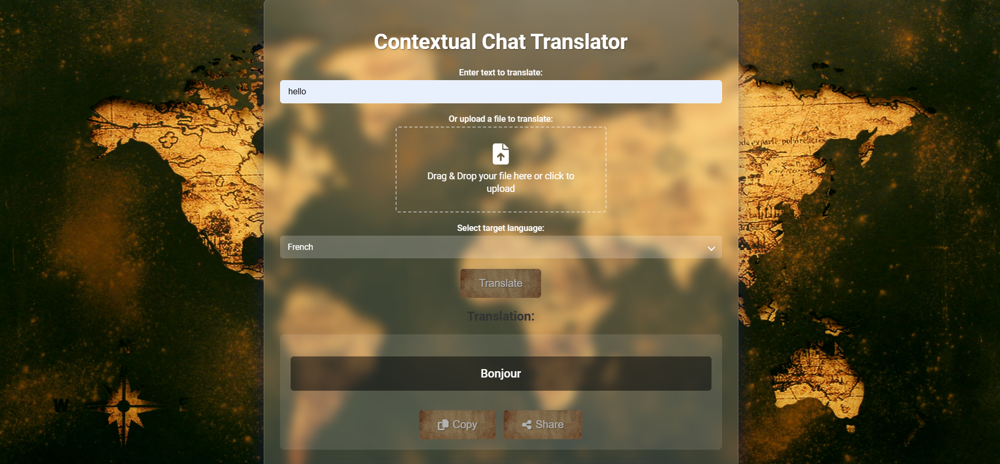
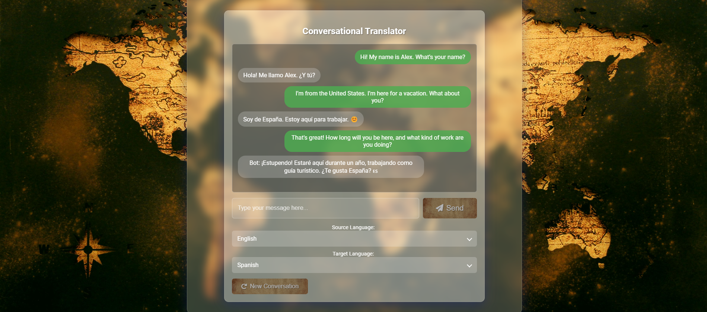

# Port To Language


## Table of Contents
- [Overview](#overview)
- [Features](#features)
- [Purpose](#purpose)
- [Technologies Used](#technologies-used)
- [Installation](#installation)
- [Configuration](#configuration)
- [Usage](#usage)
- [Project Structure](#project-structure)
- [Security Considerations](#security-considerations)
- [Contributing](#contributing)
- [License](#license)
- [Contact](#contact)

## Overview

**Port To Language** is a web application designed to provide translation services. Built using the Flask framework, this tool allows users to translate text and files between multiple languages. Additionally, it features an **Interactive Conversational Translator** that enables real-time, context-aware translations through a chat-like interface, enhancing user engagement and translation accuracy. All translation services leverage Gemini 1.5 Flash API for functionality. 





## Features
- **Text Translation**: Translate input text between a wide range of languages.
- **File Translation**: Upload `.txt` or `.pdf` files for bulk translation.
- **Interactive Conversational Translator**: Engage in real-time conversations with context-aware translations.
- **Custom Dropdown Menus**: User-friendly language selection with custom-styled dropdowns.
- **Copy & Share**: Easily copy translations to the clipboard or share them across various platforms.
- **Responsive Design**: Optimized for desktops, tablets, and mobile devices.
- **Drag and Drop File Upload**: Intuitive file uploading experience with drag-and-drop support.
- **Error Handling**: Informative flash messages for successful actions and error scenarios.

## Purpose

The **Contextual Chat Translator** was created as a method to gain experience with HTML/CSS and the use of API's to create a website with backend functionality. 

## Technologies Used

- **Backend**:
  - [Flask](https://flask.palletsprojects.com/) - Python web framework
  - [Google Generative AI](https://developers.google.com/generative-ai) - Translation API
  - [PyPDF2](https://pypi.org/project/PyPDF2/) - PDF text extraction
  - [Werkzeug](https://werkzeug.palletsprojects.com/) - WSGI utility library

- **Frontend**:
  - HTML5 & CSS3 - Structure and styling
  - JavaScript - Interactivity and AJAX requests
  - [Font Awesome](https://fontawesome.com/) - Iconography

- **Others**:
  - [Python-dotenv](https://pypi.org/project/python-dotenv/) - Environment variable management

## Installation

### Prerequisites

- [Python 3.7+](https://www.python.org/downloads/)
- [pip](https://pip.pypa.io/en/stable/installation/)
- [Git](https://git-scm.com/downloads)

### Steps

1. **Clone the Repository**

   ```bash
   git clone https://github.com/yourusername/advanced-text-translator.git
   cd port-to-language
   python app.py
